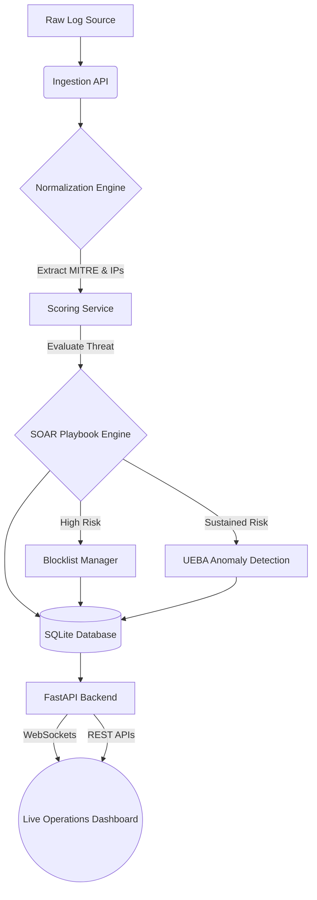

# Smart SIEM Risk Engine | Enterprise-Grade SOC Platform


An enterprise-grade **Security Information and Event Management (SIEM)** and **SOAR (Security Orchestration, Automation, and Response)** platform built from scratch. This system ingests raw security alerts, normalizes them, scores risk based on MITRE ATT&CK heuristics, and executes autonomous playbooks (like IP blocking) before rendering topological insights in a real-time web dashboard.

## 🚀 Key Features

*   **Real-Time Data Streaming & Normalization:** Ingests unstructured logs and standardizes them into structured threat intelligence schemas.
*   **User Entity Behavior Analytics (UEBA):** Tracks entities globally over time to detect "Low and Slow" attacks, issuing autonomous anomalous incident reports based on cumulative lifetime risk.
*   **SOAR Custom Rule & Playbook Engine:** 
    *   Build custom JSON-based Detection Rules directly in the web UI.
    *   Trigger automated response playbooks without writing code.
*   **Attack Topology Graph:** Utilizes **Cytoscape.js** to map adversarial external IPs dynamically against targeted internal infrastructure, color-coded by severity.
*   **Interactive KQL Threat Hunting:** A Splunk-like Threat Hunting console supporting complex queries (`mitre:T1110 risk:>80`) that generates chronological event timeline histograms.
*   **Secure Zero-Trust Architecture:** Dashboard is walled behind a proper credential validation layout leveraging secure httponly authentication cookies and Role-Based Access Control.
*   **Executive PDF Reporting:** Native PDF rendering utilizing browser-print CSS logic formats the analytical dashboard into presentation-ready C-Suite reports.

## 🏗️ Architecture



## 💻 Tech Stack
-   **Backend:** Python, FastAPI, SQLAlchemy, Uvicorn, SQLite
-   **Frontend:** HTML5, Modern CSS Variables (Dark Theme native), Vanilla JS
-   **Visualizations:** Chart.js, Leaflet.js, Cytoscape.js

## 🛠️ Quick Start

### 1. Requirements
Ensure you have `Python 3.11+` installed on your machine.

### 2. Installation
```bash
# Clone the repository
git clone https://github.com/svemula17/smart-siem-risk-engine.git
cd smart-siem-risk-engine

# Create Virtual Environment
python -m venv venv
source venv/bin/activate

# Install Dependencies
pip install -r requirements.txt
```

### 3. Launching the Platform

To start the API Server and Dashboard UI:
```bash
uvicorn app.main:app --reload
```
Navigate to `http://127.0.0.1:8000/dashboard` in your browser.
*(Use `admin` / `admin` to bypass the zero-trust portal)*

### 4. Simulating Attack Traffic
To watch the dashboard spin up in real-time, open a new terminal window, activate your virtual environment, and execute the run loop:
```bash
python run.py
```
This forces the backend into active ingestion mode, dynamically generating raw alerts and tracking entity lifespans.

***
*Developed dynamically to showcase advanced Cybersecurity Architecture and Full-Stack Engineering skills.*
