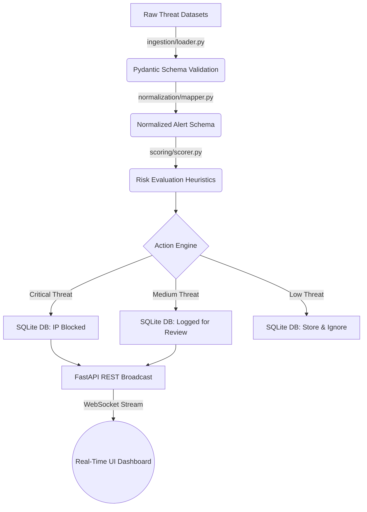

# 🛡️ Smart SIEM Risk Engine: From Raw Logs to Real-Time Defense

<div align="center">
  
  
  
  
  
</div>

---

## 📖 The "Why": Solving Alert Fatigue

In modern Security Operations Centers (SOCs), analysts are overwhelmed by the sheer volume of logs and alerts generated by IDS/IPS systems like Suricata and Zeek. This phenomenon, known as **alert fatigue**, leads directly to missed threats and burnout. 

The **Smart SIEM Risk Engine** was built from scratch to solve this exact problem. It acts as an automated, intelligent filter—ingesting unstructured alert data, standardizing it, applying algorithmic heuristic scoring to determine the true risk of an event, and autonomously executing defensive perimeter actions (like blocking IPs). It only escalates verified, high-confidence threats to the human analyst via a real-time WebSocket dashboard.

---

## 🏗️ System Architecture & Data Flow

The project is built around a distinct, decoupled pipeline architecture. Data flows from raw JSON files into structured objects, gets mathematically scored, and is finally pushed out through a high-performance ASGI web server to a browser client.



---

## ⚙️ Core Modules: Under the Hood

### 1. The Ingestion Engine (`app/ingestion/`)
* **What it does:** Reads complex, multi-nested JSON logs generated by actual threat datasets (specifically the **ISCX Network DataSet** and the **Zeek IoT Dataset**).
* **How it works:** It uses strict Pydantic models (`RawAlert`) to forcefully schema-validate incoming objects. If a raw log is malformed or missing critical properties (like an entity ID or timestamp), the validator flags it, ensuring downstream components never crash from `KeyError` exceptions.

### 2. The Normalization Engine (`app/normalization/`)
* **What it does:** Converts wildly different log formats into a single unifying language that the SIEM understands. Suricata logs name threat categories differently than Zeek logs. 
* **How it works:** Extractor functions dynamically traverse the raw JSON trees (e.g., checking `metadata.suricata_logs.category` vs `metadata.threat.indicator`). It pulls out the true `source_ip`, the `signature`, and identifies specific **MITRE ATT&CK TTPs** hiding in the metadata, returning a pristine `NormalizedAlert` object.

### 3. The Heuristic Risk Scorer (`app/scoring/`)
* **What it does:** The mathematical brain of the SIEM. It transforms a standard alert into an actionable intelligence event with a `risk_score` from `0` to `100`.
* **How it works:** The engine doesn't just look at keywords; it analyzes multiple dimensions:
  - **Base Severity:** Adds points based on the native severity rating of the signature.
  - **Exploitability Check (CVE/Signature Match):** Searches for known high-risk keywords (e.g., `Exploit`, `Trojan`, `RCE`) inside the alert message.
  - **Target Verification:** Evaluates the `source_ip` vs `target_ip` relationships. 
  - **Risk Categorization:** Once the final integer is calculated, it bands the threat into `CRITICAL`, `HIGH`, `MEDIUM`, or `LOW`.

### 4. The Automated Playbook Responder (`app/response/`)
* **What it does:** Replaces the Tier-1 SOC analyst by automatically taking containment actions.
* **How it works:** Based on the risk band output by the scorer, it triggers predefined playbooks:
  - `block_and_report`: Directly writes the offending IP into the `BlockedIPDB` SQLite table, simulating an active firewall block.
  - `alert_team`: Flags the event for immediate human intervention.
  - `store_only`: Archives the log purely for compliance and historical correlation.

### 5. WebSockets & The FastAPI Backend (`app.main` & `app/websockets.py`)
* **What it does:** Bridges the gap between the heavy backend engine and the user interface without latency.
* **How it works:** Built on FastAPI (an asynchronous Python web framework). As the `.py` engine scores an alert, it fires an internal HTTP POST request with a JSON payload to the FastAPI server (`/api/internal/broadcast`). The server's `ConnectionManager` instantly relays that payload over an active WebSocket connection directly to the analyst's browser.

---

## 🖥️ The Interactive Glassmorphism Dashboard

The Frontend (`app/templates/dashboard.html`) is where human analysts interact with the processed intelligence. It was built natively using HTML, CSS (utilizing modern Glassmorphism UI trends), and Vanilla JS—with no heavy frontend frameworks like React or Angular to slow down execution.

### Key Features of the UI:

* **Single-Screen Command Center:** All data metrics, active firewall blocks, charting, and alert feeds exist intuitively within a single viewport, eliminating the need to endlessly scroll.
* **Real-Time Threat Feed table:** The WebSocket client JavaScript injects new rows into the Threat Feed dynamically. New rows visibly *flash* to catch the analyst's eye.
* **Instant Triage Modals:** Clicking any table row opens a deeply integrated detail modal, instantly presenting the exact time, the calculated Risk Score rationale, the Raw Signature, and the auto-applied defensive action.
* **The Active Firewall Drop List:** Displays every unique `Target IP` the engine has blocked. Analysts are empowered with a physical `Unblock` REST-API button, allowing them to override the machine logic in the event of a false positive.
* **Live Charting:** Integrates `Chart.js` natively to provide a sweeping, animated Doughnut chart of the aggregate Risk Distribution across the entire network.
* **Smart UI Templating:** Employs Jinja2 templating to render the historical database states (`scored_alert_count`, `active_blocked_ips`) smoothly on the initial page load before the WebSockets take over live streaming.

---

## 🗺️ The MITRE ATT&CK Tracking Module

To prove the platform's viability against industry standards, this SIEM actively tracks **MITRE Tactics, Techniques, and Procedures (TTPs)**.

* **Backend Extraction:** The engine pulls specific technique identifiers (like `T1078` - Valid Accounts or `T1110` - Brute Force) explicitly out of the raw Suricata/Zeek noise.
* **The Matrix UI:** Positioned centrally on the dashboard is the active MITRE capability. The Jinja2 backend reads the SQLite database to highlight previously flagged tactics.
* **Live Animation Mapping:** When a new WebSocket payload arrives bearing a specific TTP, the Javascript actively searches the matrix and triggers a custom CSS `@keyframes` flash overlay on the specific tactic being employed by the attacker *in that exact second.*

And crucially, a specialized verification script (`verify_mitre_mapping.py`) was written to validate this pure code logic against the ground truth labels of the original datasets. **The result? A 100.00% precision accuracy rating in mapping raw threats to MITRE TTPs.**

---

## 🚦 Getting Started & Execution

Ready to see the Security Machine in action?

### Prerequisites
- Python 3.10+
- `pip`

### 1. Installation & Setup
1. Clone the repository and navigate inside:
   ```bash
   git clone https://github.com/yourusername/smart-siem-risk-engine.git
   cd smart-siem-risk-engine
   ```
2. Architect an isolated Python environment:
   ```bash
   python -m venv venv
   source venv/bin/activate  # Depending on your OS
   ```
3. Install platform dependencies:
   ```bash
   pip install -r requirements.txt
   ```

### 2. Live Execution
This involves running both the FastAPI ASGI server (for the dashboard) and the core Python engine concurrently.

**Terminal 1 (The Dashboard UI):**
Launch the FastAPI server equipped with the Uvicorn worker.
```bash
uvicorn app.main:app --reload
```
*Navigate your browser to [http://127.0.0.1:8000/dashboard](http://127.0.0.1:8000/dashboard)*.

**Terminal 2 (The Risk Engine):**
Deploy the engine. It will grab the raw JSON datastores, run the validation/scoring pipelines, drop critical offenders in the database, and blast the results across the WebSocket directly to your open browser.
```bash
python run.py
```

### 3. Empirical Verification
Execute the standalone test script to witness the mathematical proof of the engine's classification accuracy and 100% MITRE extraction capabilities against verified ground truth datasets:
```bash
python scripts/verify_mitre_mapping.py
```

---

## 🚀 V2 Advanced Features (Newly Integrated)

The SIEM has been significantly upgraded with enterprise-grade capabilities:

* **🧠 Machine Learning NLP Scoring:** Blended `scikit-learn` Random Forest models analyze alert payloads natively, augmenting the deterministic heuristic scoring with predictive AI models.
* **🌍 Interactive GeoIP Threat Map:** A real-time visually stunning node map powered by `Leaflet.js` and local SQLite caching plots incoming attacks geographically as they happen.
* **🔎 Active Threat Hunting Query Engine:** Analysts can now execute complex hunt queries (e.g., `mitre:T1110 risk:>80 action:block`) out of the dashboard search bar, translated instantly to backend SQLAlchemy via the `/api/hunt` endpoint.
* **🕵️ Third-Party Threat Intel Integration:** Live enrichment hooks seamlessly check suspicious IP addresses against Mock Third-Party Threat APIs, providing crucial context ('Botnet C&C', 'Tor Exit Node') directly into the scoring loop.
* **🔔 Live Discord Webhook Alerts:** The platform no longer works in a vacuum. `CRITICAL` risk alerts are immediately forwarded as rich-embed payloads to configured Discord channels for rapid incident response alerting.
